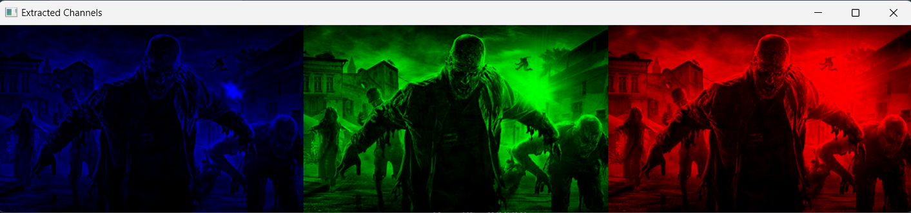

# Python Image Processing with OpenCV



## Description

This project showcases various image processing techniques using the OpenCV library in Python. It includes examples of `reading` and `displaying images`, `applying filters`, `performing edge detection`, detecting faces, and extracting color channels.

<br>

## Installation

1. Clone the repository: git clone **https://github.com/your-username/Python-Image-Processing-with-OpenCV.git**
2. Install the required packages: `pip install -r requirements.txt`

<br>

## Usage

1. Navigate to the project directory: `cd Python-Image-Processing-with-OpenCV`
2. Run the desired script: `python app.py`
3. Follow the instructions provided in the script's menu to execute the desired image processing task.

<br>

## Scripts

- `image_processing.py`: Contains the functions for the various image processing tasks.
- `app.py`: The main script that runs the image processing application.

<br>

## Resources

- OpenCV documentation: **https://docs.opencv.org/master/index.html**
- NumPy documentation: **https://numpy.org/doc/**
- Matplotlib documentation: **https://matplotlib.org/stable/contents.html**

<br>

## Examples

```py

from image_processing import show_image, apply_filter, resize_image, detect_faces, extract_channels

img = 'im2.jpg'

# Show an image
show_image(img)

# Apply a filter to an image
apply_filter(img)

# Resize an image
resized_img = resize_image(img, 500, 500)

# Detect faces in an image
detect_faces(img)

extract_channels(img)
```

<br>

## License

This project is licensed under the MIT License - see the LICENSE file for details.

Feel free to customize this ReadMe file as per your needs and requirements. Happy coding!
